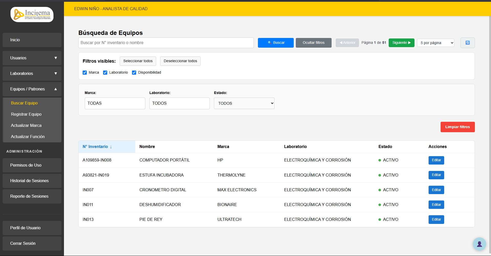
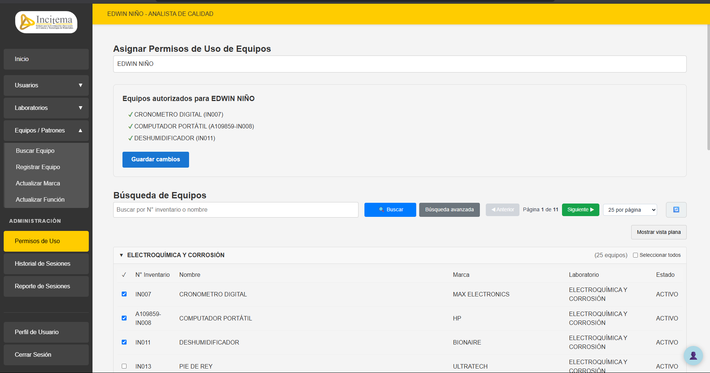
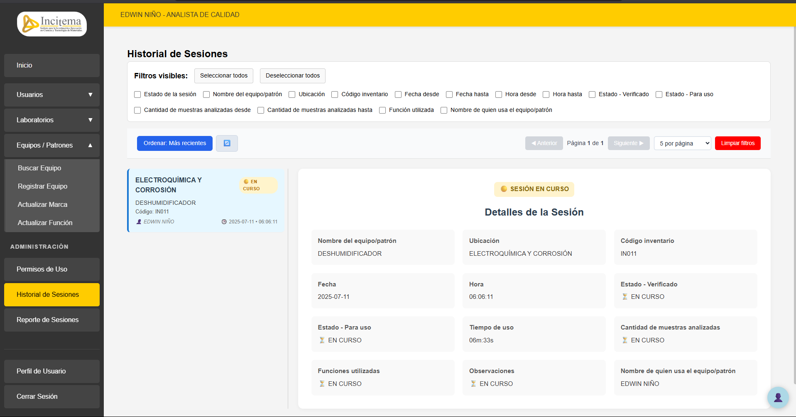
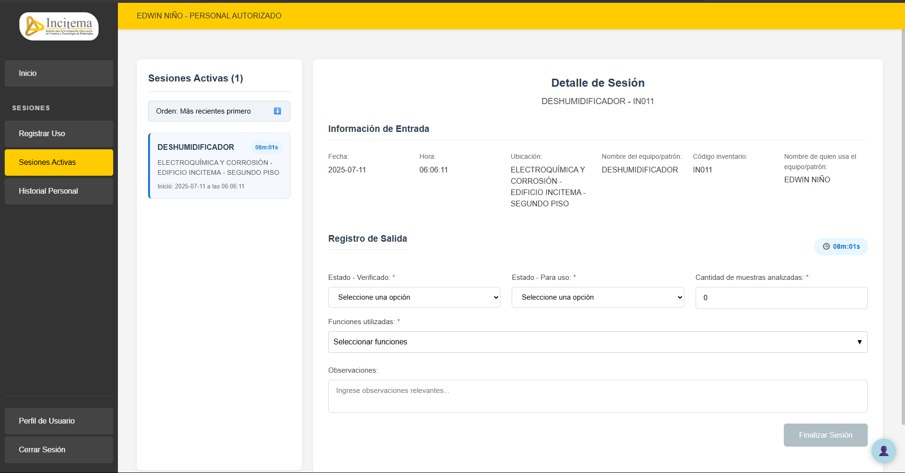

# 🧪 GELI - Gestor de Equipos de Laboratorio Institucional

**GELI** es una plataforma web desarrollada en Angular que permite la gestión integral del uso de equipos en entornos de laboratorio. Diseñada para universidades y centros de investigación, GELI facilita el registro, monitoreo, control y reporte de sesiones de uso de equipos por parte de personal autorizado y administradores de calidad.

📖 **Documentación completa** disponible en:  
👉 [https://deepwiki.com/juanitomanoplateada/geli/1-overview](https://deepwiki.com/juanitomanoplateada/geli/1-overview)

---

## 📑 Tabla de Contenido

- [🎯 Propósito y Alcance](#-propósito-y-alcance)
- [🏗️ Arquitectura del Sistema](#-arquitectura-del-sistema)
- [🔐 Control de Acceso Basado en Roles](#-control-de-acceso-basado-en-roles)
- [🧩 Funcionalidades Principales](#-funcionalidades-principales)
- [🛠️ Tecnologías Utilizadas](#-tecnologías-utilizadas)
- [📂 Estructura del Proyecto](#-estructura-del-proyecto)
- [🧭 Navegación y UX](#-navegación-y-ux)

---

## 🎯 Propósito y Alcance

GELI está orientado a la gestión de sesiones de uso de equipos en laboratorios institucionales. Administra:

- Registro y seguimiento de sesiones de uso de equipos
- Gestión de usuarios y roles
- Administración de inventario de equipos y funciones
- Control de laboratorios y ubicaciones
- Generación de reportes y estadísticas

👥 **Tipos de usuario:**
- `QUALITY-ADMIN-USER`: Administradores del sistema
- `AUTHORIZED-USER`: Usuarios con permisos de uso de equipos

---

## 🏗️ Arquitectura del Sistema

GELI está construido sobre una arquitectura modular Angular 18 con renderizado del lado del servidor (SSR). 

### 🔧 Componentes Clave:

- `AppComponent` y `appRoutes` (`app.routes.ts`)
- `DashboardComponent`: interfaz central del sistema
- Guardias como `AuthGuard` para control de acceso

### 🧵 Servicios Principales:
- `UserSessionService`: manejo de sesión, token, roles
- `EquipmentUseService`, `UserService`, `EquipmentService`, `LaboratoryService`: acceso a datos y lógica de negocio

### 🌐 Backend SSR:
- `Express` (server.js): servidor Node.js para renderizado y archivos estáticos

---

## 🔐 Control de Acceso Basado en Roles

La lógica de acceso se gestiona mediante tokens JWT y verificación local con `UserSessionService`.

```ts
// Ejemplo de verificación de rol
this.userSessionService.getRoles().includes('QUALITY-ADMIN-USER');
```

Los menús y componentes visibles se ajustan automáticamente según el rol autenticado.

---

## 🧩 Funcionalidades Principales

| Área Funcional         | Rol Requerido         | Componentes Clave                                                                 | Funcionalidad Principal                                             |
|------------------------|------------------------|-----------------------------------------------------------------------------------|----------------------------------------------------------------------|
| **Gestión de Sesiones**| `AUTHORIZED-USER`      | `RegisterSessionComponent`, `ActiveSessionsComponent`, `PersonalSessionHistoryComponent` | Registro y seguimiento de sesiones personales                      |
| **Administración de Usuarios** | `QUALITY-ADMIN-USER` | `SearchUserComponent`, `RegisterAuthorizedPersonnelComponent`, `RegisterQualityAnalystComponent` | Gestión y asignación de roles a usuarios                           |
| **Gestión de Equipos** | `QUALITY-ADMIN-USER`   | `SearchEquipmentComponent`, `RegisterEquipmentComponent`, `BrandsComponent`, `FunctionsComponent` | Inventario de equipos, marcas y funciones                          |
| **Gestión de Laboratorios** | `QUALITY-ADMIN-USER` | `SearchLaboratoryComponent`, `RegisterLaboratoryComponent`, `LocationsComponent` | Administración de laboratorios y ubicaciones                       |
| **Reportes de Sesiones** | `QUALITY-ADMIN-USER` | `SessionHistoryComponent`, `SessionReportComponent`                             | Visualización y exportación de reportes de sesiones                 |

---

## 🛠️ Tecnologías Utilizadas

### ⚙️ **Frontend**
- Angular 18.2.13 (con Standalone Components)
- Angular Universal (SSR)
- TypeScript 5.4+
- RxJS 7.8.2
- Chart.js + ng2-charts (visualización de datos)
- html2canvas, jsPDF, jsPDF-autotable (generación de reportes PDF)

### 🛡️ **Seguridad**
- JWT (`jwt-decode`) para autenticación
- `localStorage` para persistencia de sesión

### 📁 **Exportación e Importación de Datos**
- XLSX: generación de Excel
- file-saver: descarga de archivos

### 🌐 **Backend SSR**
- Node.js + Express 4.18.2

---

## 📂 Estructura del Proyecto

```plaintext
src/
├── app/
│   ├── features/
│   │   ├── dashboard/
│   │   │   └── dashboard.component.{html,ts,scss}
│   │   ├── sessions/
│   │   ├── users/
│   │   ├── equipments-patterns/
│   │   ├── laboratories/
│   │   └── reports/
│   ├── core/
│   │   └── auth/services/user-session.service.ts
│   └── app.routes.ts
├── assets/
└── index.html
```

---

## 🧭 Navegación y UX

- Navegación jerárquica con submenús colapsables
- Visibilidad de elementos dependiente del rol del usuario
- Interfaz responsive con cierre automático del sidebar en móvil (`toggleSidebar()`, `onNavigate()`)

---

## 🔗 Documentación Ampliada

Para más detalles, incluyendo ejemplos de código, flujos de navegación y personalización:

📘 **DeepWiki GELI**  
👉 [https://deepwiki.com/juanitomanoplateada/geli/1-overview](https://deepwiki.com/juanitomanoplateada/geli/1-overview)

---

## 🖼️ Vista previa de módulos

### 🔍 Módulo de Búsqueda


### 🔐 Módulo de Permisos


### 📊 Historial de Sesiones


### ▶️ Módulo de Sesiones Activas

